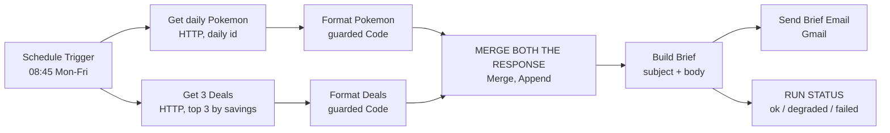

# Project 1: Daily Brief Automator (n8n)

A small automation that emails me a short "daily brief", built with n8n and two public APIs. It is designed to run every weekday morning on a schedule; in this repository it is delivered **inactive** and run manually (see Deployment status). The point of the project was not the content of the email. It was to build something that **keeps working when parts of it break**, and to prove that with deliberate failure tests.

> Public APIs only. No work data. No credentials are stored in this repository.

## 1. Problem

Collecting small pieces of information from different websites every morning is repetitive, and a naive automation breaks completely when one source fails (an API is down, a URL changes, a response is empty). I wanted a pipeline where **one failing source never kills the whole run**, and where a failure is visible instead of silent.

## 2. Users

One user (me). The "customer" is a person who wants a short, reliable email at 08:45 India time on weekdays without opening anything.

## 3. Requirements

| # | Requirement | Type |
|---|-------------|------|
| R1 | Be schedulable to run on weekdays at 08:45 India time (the trigger is configured; the workflow is kept inactive, see Deployment status) | Functional |
| R2 | Fetch a "Pokémon of the Day" (changes daily) from PokéAPI | Functional |
| R3 | Fetch the top 3 game deals by savings from CheapShark | Functional |
| R4 | Combine both into one plain-text email with a dated subject and send it to me | Functional |
| R5 | If one source fails, the email still goes out with a clear placeholder for that section | Reliability |
| R6 | If both sources fail, the email still goes out and says so | Reliability |
| R7 | Each run records an overall status (ok / degraded / failed) and a status per source | Observability |
| R8 | API calls time out (10 s) instead of hanging | Reliability |

## 4. Architecture

How it works:

1. **Schedule Trigger** is configured to fire at 08:45 on weekdays (cron `45 8 * * 1-5`). It only fires when the workflow is active, and the workflow timezone must be set to `Asia/Kolkata`.
2. **PokéAPI** is called with a Pokémon id calculated from today's date: `Math.floor(Date.now()/86400000) % 1000 + 1`. The id changes every day, with no database needed.
3. **CheapShark** is called for the 3 deals with the biggest savings.
4. Both HTTP nodes are set to **On Error: Continue**, so an HTTP failure does not stop the workflow.
5. Each source has a **guarded Code node**. If the data is missing or malformed, it outputs a placeholder such as "(Game deals temporarily unavailable)" instead of throwing an error.
6. **Merge (Append)** keeps all items from both branches. I chose Append over "Combine by Position" because Combine silently drops items when one side is empty.
7. A **final Code node** assembles the dated subject and the email body.
8. **Gmail** sends the email to me.
9. A **side-branch status node** labels the run `ok`, `degraded` or `failed`, and each source `ok` or `failed`.

## Deployment status

The workflow is **built and tested, but intentionally not activated**. A schedule trigger only fires while n8n is running, and mine runs on my own PC, which is not on at 08:45 every weekday. Rather than rely on a machine that may be off, I kept it inactive and ran every test by hand with "Execute Workflow".

To make it run on its own, it needs an always-on home: n8n Cloud, a small server, or a PC that stays on. Then switch the workflow to **Active** and set its timezone to `Asia/Kolkata`. Nothing in the design needs to change for that.

## 5. Failure scenarios and design decisions

| Scenario | What happens | Why |
|----------|--------------|-----|
| PokéAPI returns an error (e.g. 404 for an unknown name) | Pokémon section shows a placeholder; deals still appear | On Error: Continue plus a guarded Code node |
| CheapShark returns an error (e.g. 404 on a wrong path) | Deals section shows a placeholder; Pokémon still appears | Same pattern, independent branches |
| Both sources fail | Email still sent, with two placeholders; status `failed` | An email saying "everything failed" tells me something is wrong. No email would look like silence. |
| API is slow | Request times out after 10 s | Timeout set on both HTTP nodes |
| Gmail login expires | The send step fails with a credential error | See Limitations. Fixed by reconnecting the credential. |

Design decision: a `failed` run still sends an email (see row 3 above). I considered suppressing it and decided against it for the reason given.

## 6. Test log

| # | Test | Expected | Observed | Result |
|---|------|----------|----------|--------|
| 1 | Happy path | Pokémon block plus 3 deals | Brionne (#729) plus 3 deals | Pass |
| 2 | Pokémon broken (name typo, `pikachuu`) | Pokémon placeholder, deals intact | Placeholder shown, deals intact | Pass |
| 3 | CheapShark broken (`/dealz`, HTTP 404 confirmed) | Deals placeholder, Pokémon intact | Placeholder shown, Pokémon intact | Pass |
| 4 | Delivery with an expired Gmail login | Email sent | "Access could not be refreshed" credential error | **Fail**, fixed by reconnecting the credential |
| 5 | Delivery after reconnect, healthy run | Email with date, Pokémon and 3 deals | Email received (4 Oct 2026): Pokémon #731 plus 3 deals | Pass |
| 6 | CheapShark broken (`/dealz`) with delivery | Email arrives, Pokémon intact, deals placeholder | Email received with Pokémon #731 and "(Game deals temporarily unavailable)" | Pass |
| 7 | Both APIs broken with delivery | Email arrives with two placeholders | Email received with both placeholders | Pass |
| 8a | Status node, both APIs broken | `run_status: failed`, both sources `failed` | `failed`, `pokemon_status: failed`, `deals_status: failed`, `brief_length: 136` | Pass |
| 8b | Status node, one source broken (deals typo) | `run_status: degraded`, Pokémon `ok`, deals `failed` | `degraded`, `pokemon_status: ok`, `deals_status: failed`, `brief_length: 170` | Pass |
| 9 | Status node, real URLs restored, healthy run | `ok` for all three fields, longer brief | `ok`, `pokemon_status: ok`, `deals_status: ok`, `brief_length: 411` | Pass |

All rows above were run and observed on 4 Oct 2026. Rows 8a, 8b and 9 were checked on the status node's output; the email itself was confirmed in rows 5 to 7.

## 7. Limitations (honest list)

- **Status is derived from placeholder wording.** The status node checks whether the email text contains the placeholder phrase. That is brittle: changing the wording would silently break the status. A better design passes an explicit status field through the pipeline.
- **Not deployed on an always-on host.** Scheduled runs have not been observed, because the workflow is inactive. All tests were run manually. The schedule and timezone settings are configured but unproven.
- **No error reason is recorded.** A placeholder says a source failed, not why (404, timeout, bad JSON). I need to open the execution to find out.
- **Statuses are not stored anywhere.** Each run's status exists only in n8n's execution history. There is no log I can chart over time.
- **No retry.** A temporary failure shows a placeholder for that day rather than trying again.
- **Gmail credential expiry.** My Gmail login expired mid-project. The likely cause (unconfirmed) is a Google OAuth app in Testing mode, whose refresh tokens expire after about 7 days. Options: reconnect, move the consent screen to production, or use an App Password with the Send Email (SMTP) node.
- **A big discount is not a good deal.** One returned deal was 96% off, with a deal score of 0.0 and "Mostly Negative" reviews. The brief shows it anyway. A minimum-score filter would improve it.
- **No alert when the delivery step itself fails.** If Gmail fails, nothing tells me.

## 8. What I learned

- Merge **Append** vs **Combine by Position**: one keeps everything, the other can silently drop data.
- `$input.first()` vs `$input.all()`: a list response becomes several items, so the wrong choice loses data.
- **Fixed vs Expression** mode in n8n fields: a pasted `{{ }}` stays literal in Fixed mode and produced a 400 Bad Request.
- Failure paths are designed, not hoped for. On Error: Continue plus guarded code is what turns a crash into a placeholder.
- Test by breaking things on purpose, one source at a time and then both, and write down what you actually observed.
- Credentials expire. Automation needs a plan for that.

## 9. Next improvements (not done)

1. Pass an explicit status and error reason through the pipeline instead of reading placeholder text.
2. Log each run's status to a sheet or database so health can be charted later.
3. Add a retry on HTTP failures.
4. Hide deals below a minimum deal score.
5. Add a notification path for delivery failures.

## 10. Stack

n8n (run locally), PokéAPI, CheapShark API, Gmail, JavaScript (Code nodes, used to read, debug and extend, not as the main build tool).
